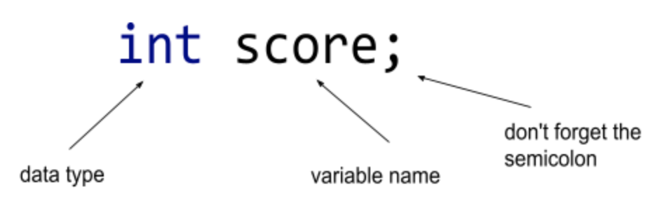
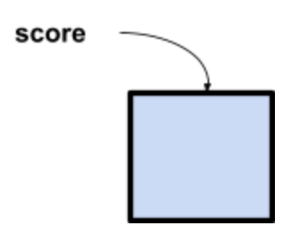
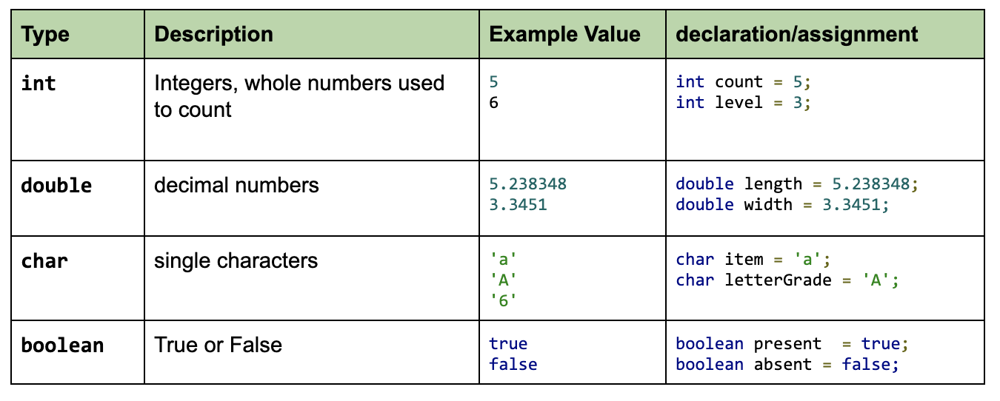
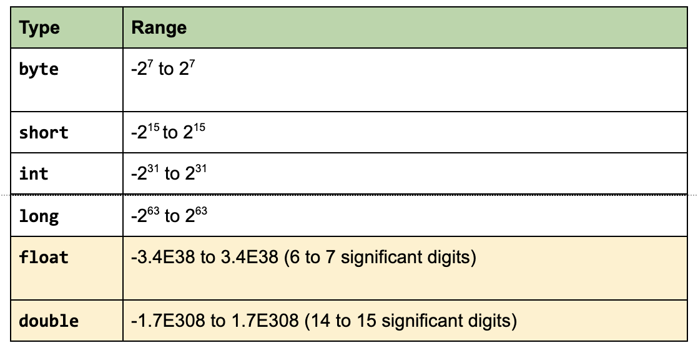

# 1.2 Variables and Types
When trying to solve a problem programmatically, we need to be able to represent the data within the problem.

Consider the different types of information that a video game tracks about a player:


| Information  | Example Value  |  Type |
|---|---|---|
|score|59|integer|
|teamname|Lakers|word(s)|
|player|LeBron James|words|
|speed|*****|symbols, characters|
|strength|89%|percentage|


In programming, we use variables to track data. In Java, variables have a: 
* name -   i.e score
* type - i.e integer
* value - i.e 96

## Declaring a Variable

When we want to create a variable and store data in it, we must first declare it. Consider our score example, we would declare it like this:

`int score;`


When we declare a variable, we are telling the compiler to set aside some space in memory and label it with a name.


# Assigning a value to a variable
Once a variable is declared, we can assign a value to it using the assignment operator `=`

```
int score;
score = 0;

int fouls = 0;   //declare and assign a value simultaneously
fouls = 1;	  //update the fouls variable to the value 5.
```

## Java Primitive Types



## Strings
* String variables contain of sequence, or string, of characters. 
* Strings are not a primitive data type, they are what we call *objects* and are treated slightly differently.
* Example values: `"pizza"`, `"hotdog"`, `"hamburger"`, `"99"`.  
* String values are what we call *string literals* and are enclosed by double quotes `""`

### Declaring a String
```
String firstName; //define a string variable
firstName = "Eric";  // Assign a value to firstName
System.out.println(firstName); //Print out the value of the String variable
```


### More on Numeric Primitive Types
Numbers can be represented by other primitive types, which ones you use depends on the what range of numbers to work with.




## Choosing a Variable Name
### Variable Name Rules
* Must start with a letter, $, or _
* rest of of name can be letters, numbers, or _
* cannot contain a space
* cannot be one of the Java keywords
* cannot be duplicated
* variable names are case sensitive, i.e `firstName` is different than `FirstName`

### Variable Naming Conventions
Java naming conventions are best practices to follow as you decide what to name your identifiers such as class, package, variable, constant, method etc.  For variables, java conventions are;

* should start with lowercase letter e.g. firstName, orderNumber etc.
* camelcase - If name is combined with two words, second word will start with uppercase letter always e.g. `firstName`, lastName`, `postalCode`.
* variable names should be meaningful (descriptive).  i.e int numberOfCars, not int n

#### One More Convention
While you can name your variables whatever you want, following the conventions above of course, one more convention we will use is the use of a prefix. We include prefixes in your variables to make it clear what data type the variable represents.

|data type|prefix|example|
|---|---|---|
|`int`|`int`|`intAge`|
|`double`|`dbl`|`dblDistance`|
|`char`|`chr`|`chrKeyPress`|
|`boolean`|`bln`|`blnIsHungry`|
|`String`|`str`|`strFirstName`|

Good variables names have these benefits:
* More organized because if you have lots of lines of code, it is easier to find a good variable name VS `x`, `y`, `z`
* Variable name reflects the content.
* Reduce the risk of having duplicate variable names
* Your coworker reading your code will immediately know that data goes in there and the type.


